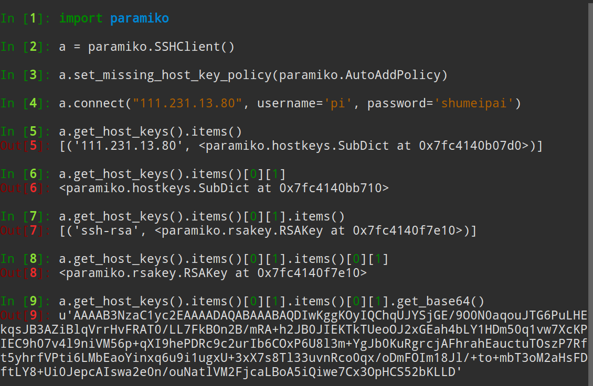
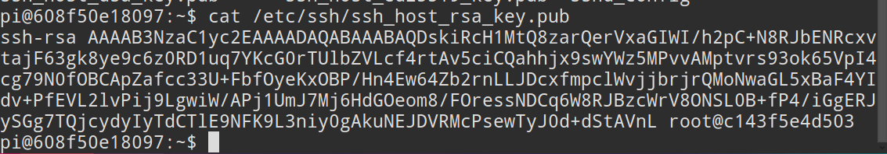
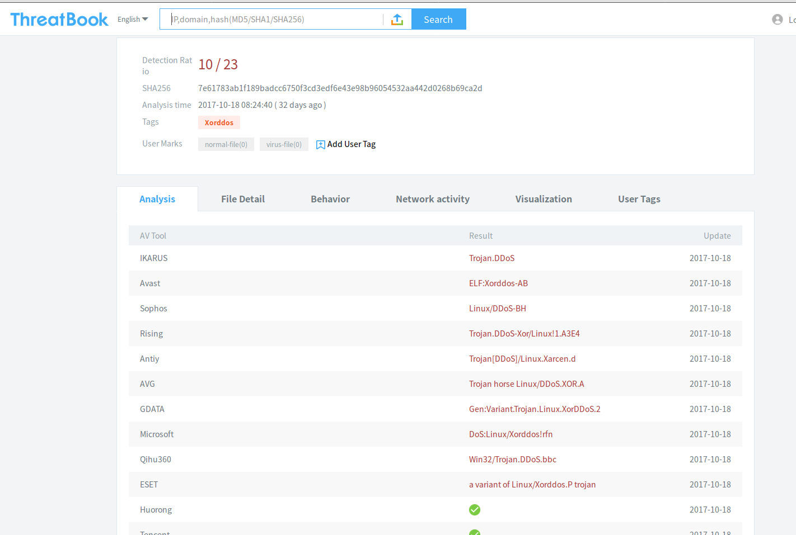
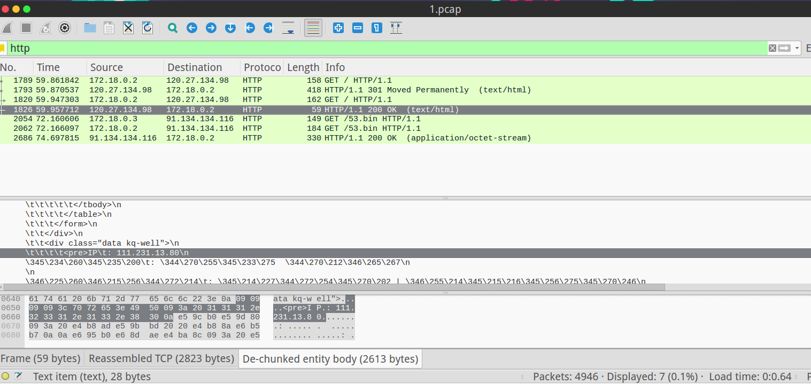
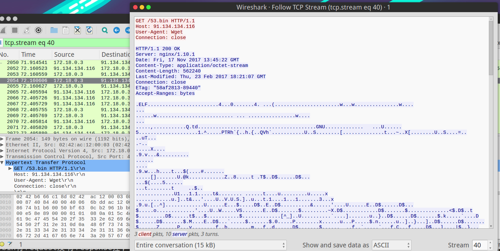
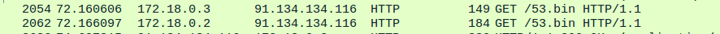
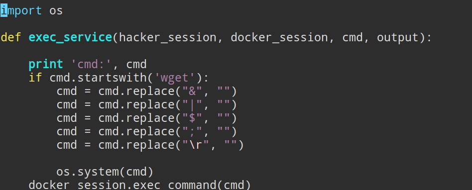
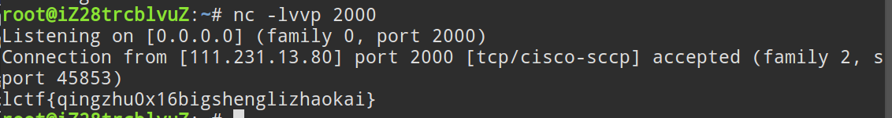
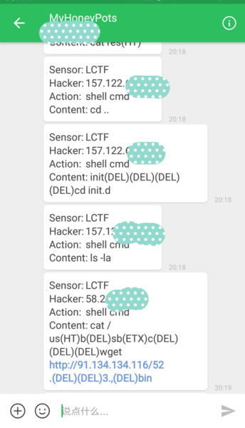

# 2017 LCTF misc 树莓派wp

## 刚上线
1. 题目介绍只给了个ip，有师傅当做web题，发现点不开。
2. 扫了一波端口后，只有22开着，所以入口点肯定在这里。
3. 根据题目的提示，按照正常的思维确实应该登录pi:raspberry，本来也是打算设置成这样，但是这个密码太弱了，题目还没上线就被黑铲扫了好几波，直接改密码种木马一波带走了。所以就改了一个需要一些脑洞的密码pi:shumeipai，可能有师傅在这里卡了一下。

## 第一个hint
> hint1: 都告诉你密码了

1. 这个hint主要提示弱密码是什么，因为不想让师傅们耽误太多时间，给出后很多师傅都上来了。
2. 这时候ssh进去会发现是一个低权限帐号，很多操作都受限了，uname看内核版本也很高，这之后很多师傅就开始四处搜刮flag，bash_history、.swp等等，还看了所有文件的修改时间。
3. 但是一番搜索后除了那个假flag什么发现也没有。在搜索的过程中，查看主机的网络状态`netstat -autpn`，会发现所有的ssh连接来源都是172.18.0.3，在这里应该会产生一些疑问，ping172.18.0.1、172.18.0.3都是通的，pi本机是172.18.0.2。
4. 这时候可以猜测，ssh连接被0.3动了手脚，通过ssh的指纹完全可以验证0.3是师傅们和0.2之间的中间人。
5. 下图是我们ssh连接时收到的公钥指纹:

6. 下图是172.18.0.2主机sshd配置文件夹中的公钥:

7. 可以看出两者是不一样的，所以验证了0.3在做SSH连接的中间人的猜测，这样一来有很大可能真的flag在0.3里。

## 第二个hint
> hint.pcap

1. 这是一个很重要的hint，流量中出现的主要IP是`172.180.2 172.180.3`，在流量包里可以看到明显的特征: 在建立了SSH连接后，外网发给0.3的加密数据包，0.3会先与0.2通信，0.2返回给0.3数据后，0.3再返回给外网的ip，在这里也能够证实0.3在做ssh的中间人。
2. 一般打ctf的流量包里面都会藏一些有用的东西，所以这里设了个坑，下载了一个53.bin，但是文件的具体内容没有什么用，此文件实际上是之前部署在公网的蜜罐捕获到的DDos木马，所以先对执行了此文件的师傅说声对不起。

3. 但是下载这个53.bin也不完全是坑人的，流量包里的http都很重要，过滤一下http可以看到只有几个数据包，User-Agent是wget，wget了cip.cc，并重定向到了www.cip.cc，这么做的初衷了为了暴露题目的公网IP，但是师傅们后来决定先不放这个流量包，所以题目描述直接把IP给出来了，这里也没什么用了。

4. 那为什么53.bin有request没有response捏，实际上Follow一下TCP stream就能看到后面的都是二进制的数据，wireshark没有把他们识别为http协议。

5. 实际上这个包最关键的地方在下图中两个GET 53.bin，这里涉及到一些蜜罐的东西，玩过SSH蜜罐的师傅可能了解，入侵者下载的恶意文件很可能随着执行而自动删除，所以绝大多数ssh蜜罐，无论低中高交互都会有一个功能，就是碰到wget命令，会解析命令并自动下载里面包含的恶意文件，这也就解释了为什么wget命令在两台主机上都执行了一次。

6. 所以如果wget命令及参数没有解析好的话，是有可能导致命令注入的。这一点在后面的hint也有提示。这个漏洞我比较粗暴的设置为，当0.3主机得到了攻击者的命令，如果命令以wget为开头，則直接os.system(cmd)，当然还是做了一些过滤的。

7. 可以看到shell里常见的引入新的命令的符号大多数都做了过滤，比如`& | $()`，但是还是留下了姿势可以绕过，比如`\n`，

8. ssh tunnel的应用除了我们常用的shell，实际上还有exec，此应用不会在sshd上请求shell，只执行一条命令，比如`ssh pi@123.123.123.123 'ls'`

9. 但为了方便构造，可以使用python的paramiko库来get flag

10. 实际上也可以直接getshell

## 最后
1. wetland是我之前写的一个高交互ssh蜜罐，基于python的paramiko库。这个题就是直接拿它改动了一点。地址在本github帐号的wetland仓库里。
2. 题目的架构为真实云主机上跑两个docker容器，分别为wetland(172.18.0.3)和sshd(172.18.0.2)，其中wetland是蜜罐程序，sshd用于执行黑客的命令。
3. 两个容器的dockerfile在docker文件夹中，sshd是对rastasheep/ubuntu-sshd的修改，降低了权限。wetland是对docker hub上ohmyadd/wetland镜像的修改，修改了两个文件，加上了命令注入。
4. 最后既然是蜜罐，肯定会记录执行的操作啦，日志文件都有保留，但不知道公开合不合适，就先不放出来了。

5. 最后一张用bearychat来实时看都有什么操作:)

